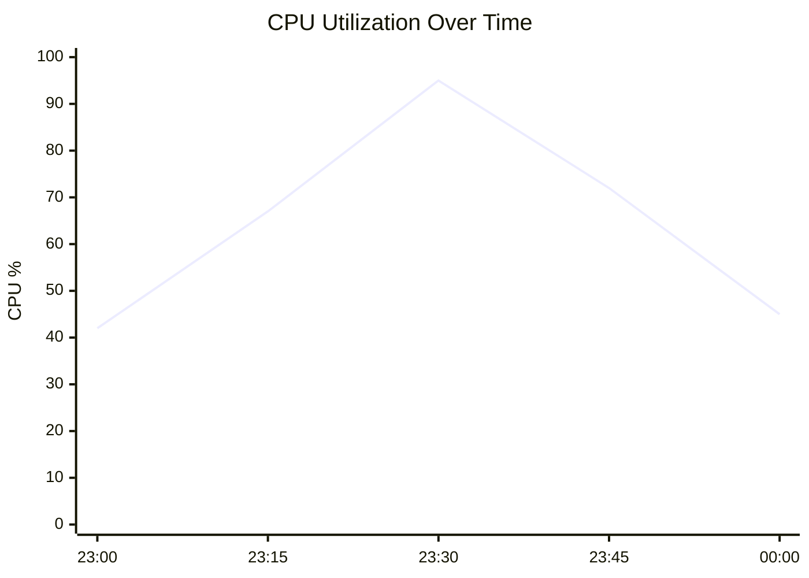
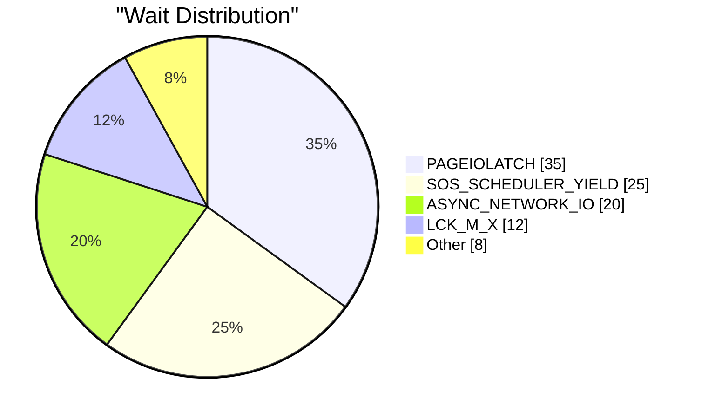
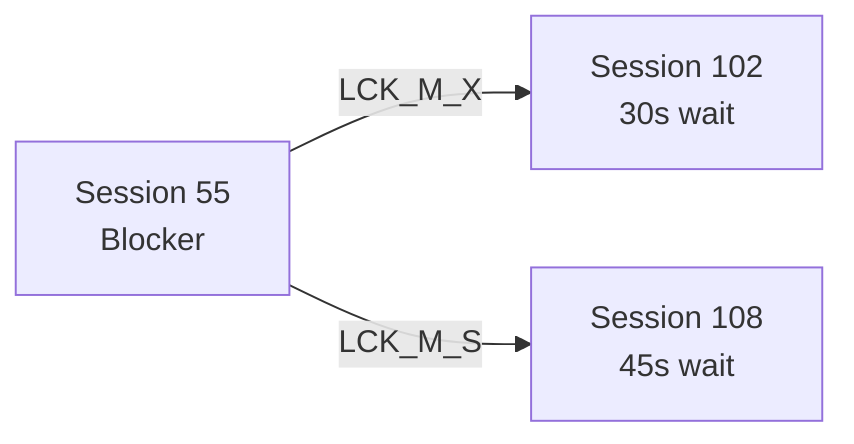

# SQL Server Diagnostic Strategy for MCP Tools

This document defines the diagnostic methodology for analyzing SQL Server performance issues using the database watcher MCP tools. The tools query historical telemetry stored in Kusto/ADX, enabling safe, read-only post-mortem analysis.

---

## Persona & Approach

- **Role**: Senior SQL Server Performance Engineer / Forensic Analyst
- **Tone**: Analytical, inquisitive (looking for "why"), and methodical
- **Objective**: Analyze telemetry from a workload to identify performance bottlenecks
- **Methodology**: "Think in Buckets" — Resources → Indexing → Query Structure

---

## Connection Workflow

Before diagnosis, establish a connection to the database watcher telemetry:

| Step | Tool | Purpose |
|------|------|---------|
| 1 | `list_cluster_databases` | Discover databases on the Kusto cluster (if database name unknown) |
| 2 | `connect_kusto` | Connect to the Kusto cluster and database containing telemetry |
| 3 | `list_monitored_databases` | Discover which SQL databases have telemetry available |

**Prerequisites:**
- User authenticated via `az login` or VS Code Azure Account extension
- Access to a Kusto cluster with database watcher telemetry

---

## Telemetry Tables (Azure SQL Database)

The database watcher data store contains the following tables for Azure SQL Database targets. Use the curated diagnostic tools when available. For ad-hoc exploration, use `run_kql`. To discover columns for any table, run `tablename | getschema` via `run_kql`.

| Table | Collection Freq | Description |
|-------|----------------|-------------|
| `sqldb_database_active_sessions` | 30s | Sessions running requests, blocking, or with open transactions |
| `sqldb_database_sql_backup_history` | 5min | Successfully completed database backups |
| `sqldb_database_change_processing` | 1min | Aggregate log scan stats for CDC or Change Feed |
| `sqldb_database_change_processing_errors` | 1min | Errors during change processing |
| `sqldb_database_connectivity` | 30s | Connectivity probes (login + query) |
| `sqldb_database_geo_replicas` | 30s | Geo-replica metadata and statistics |
| `sqldb_database_index_metadata` | 30min | Index partitions with definition, properties, and operational stats |
| `sqldb_database_memory_utilization` | 30s | Memory consumption by memory clerk |
| `sqldb_database_missing_indexes` | 15min | Missing index recommendations from the query optimizer |
| `sqldb_database_oom_events` | 1min | Out-of-memory events |
| `sqldb_database_performance_counters_common` | 10s | Commonly used performance counters |
| `sqldb_database_performance_counters_detailed` | 1min | Detailed performance counters for troubleshooting |
| `sqldb_database_properties` | 5min | Database options, resource governance limits, metadata |
| `sqldb_database_query_runtime_stats` | 15min | Query Store runtime execution statistics |
| `sqldb_database_query_wait_stats` | 15min | Query Store wait category statistics |
| `sqldb_database_replicas` | 30s | Database replica metadata and replication statistics |
| `sqldb_database_resource_utilization` | 15s | CPU, Data IO, Log IO resource consumption |
| `sqldb_database_session_stats` | 1min | Session statistics aggregated by login, host, app |
| `sqldb_database_sos_schedulers` | 1min | SOS scheduler, CPU node, and memory node stats |
| `sqldb_database_storage_io` | 10s | Cumulative IOPS, throughput, and latency per database file |
| `sqldb_database_storage_utilization` | 1min | Database storage usage including tempdb, Query Store, PVS |
| `sqldb_database_table_metadata` | 30min | Table/view metadata: row count, space, compression, constraints |
| `sqldb_database_wait_stats` | 10s | Cumulative wait statistics by wait type |

**Common columns** across all tables: `sample_time_utc`, `database_name`, `logical_server_name`, `replica_type`. Some tables also have `collection_time_utc` when collection time differs from sample time.

---

## Diagnostic Phases

Follow these phases in order. Analyze results at each step before proceeding. If critical issues are found (e.g., severe blocking, resource exhaustion), pivot to investigate that specific symptom immediately.

### Phase 1: Wait Stats Analysis (The Bottleneck)

**Goal**: Understand where time is being spent during the workload.

**Tool**: `history_waits`

| Wait Type | Category | Indicates |
|-----------|----------|-----------|
| `CXPACKET` / `CXSYNC_PORT` | Parallelism | Queries using parallel plans. Check MAXDOP or missing indexes |
| `CXCONSUMER` | Parallelism | Usually benign — threads waiting for work |
| `PAGEIOLATCH_SH` / `PAGEIOLATCH_EX` | I/O | Reading/writing pages from disk. Memory pressure or missing indexes |
| `SOS_SCHEDULER_YIELD` | CPU | CPU pressure — threads yielding voluntarily |
| `LCK_M_S` / `LCK_M_X` / `LCK_M_IX` | Locking | Lock contention — blocking between sessions |
| `ASYNC_NETWORK_IO` | Network | Client not consuming results fast enough (RBAR or network latency) |
| `WRITELOG` | Log | Transaction log write waits. Check log disk performance |
| `RESOURCE_SEMAPHORE` | Memory | Queries waiting for memory grants |
| `PAGELATCH_XX` on allocation pages | TempDB | TempDB contention (page 2:1:1, 2:1:2, etc.) |

**Thresholds:**
| Metric | Healthy | Warning | Critical |
|--------|---------|---------|----------|
| Parallelism waits (%) | <5% | 5-15% | >15% |
| Lock waits (%) | <5% | 5-15% | >15% |
| IO waits | Investigate | if prominent | in top waits |

**Decision Tree:**
- **If blocking (LCK_* waits) is high** → Pivot to Phase 1A: Blocking Analysis
- **If waits look normal** → Proceed to Phase 2

---

### Phase 1A: Blocking Analysis (Pivot)

**When to use**: LCK_* waits appear in top wait types, or user reports deadlocks/timeouts.

**Tool**: `history_blocking`

This tool identifies sessions that were waiting on locks held by other sessions, including:
- Blocked and blocking session IDs
- Estimated blocking duration
- Wait types involved

**Recommendations if blocking found:**
- Review queries from blocking sessions for optimization
- Consider shorter transactions or different isolation levels
- Check for missing indexes causing long-running queries
- Look for application patterns causing lock escalation

---

### Phase 2: Query Analysis (The Culprit)

**Goal**: Identify which queries contributed to the waits found in Phase 1.

**Tool**: `history_queries`

**Sort by resource matching Phase 1 findings:**
| Phase 1 Finding | Sort Parameter |
|-----------------|----------------|
| CPU pressure (SOS_SCHEDULER_YIELD) | `orderBy: 'cpu'` |
| I/O waits (PAGEIOLATCH_*) | `orderBy: 'reads'` |
| General slowness | `orderBy: 'duration'` |
| High concurrency issues | `orderBy: 'executions'` |

**Key metrics to examine:**
- **Total CPU/Duration/Reads**: Impact on system
- **Average CPU/Duration/Reads**: Per-execution cost
- **Execution count**: Frequency of execution

**Follow-up Tool**: `history_waits_by_query`

For specific expensive queries, analyze their per-query wait breakdown to understand what each query is waiting on:
- CPU waits → Query optimization needed
- Lock waits → Contention issues
- I/O waits → Missing indexes or memory pressure
- Memory waits → Large memory grants, sorts, hashes

**Transition**: "Wait stats show [X] is the primary bottleneck. Let's identify which queries are responsible."

---

### Phase 3: Resource Health (The Capacity Check)

**Goal**: Check if the system is hitting resource limits.

#### Phase 3A: CPU, Data I/O, Log I/O Utilization

**Tool**: `history_resources`

| Metric | Healthy | Warning | Critical |
|--------|---------|---------|----------|
| CPU % | <70% | 70-85% | >85% |
| Data I/O % | <70% | 70-85% | >85% |
| Log I/O % | <70% | 70-85% | >85% |

**Assessment:**
- Sustained high CPU → Scale up compute or optimize queries
- High Data I/O → Memory pressure, missing indexes, or need more IOPS
- High Log I/O → Transaction log throughput limit, consider batching writes

#### Phase 3B: Key Performance Counters

**Tool**: `history_counters`

| Counter | Healthy | Warning | Critical |
|---------|---------|---------|----------|
| Page Life Expectancy | >1000s | 300-1000s | <300s |
| Buffer Cache Hit Ratio | >95% | 90-95% | <90% |
| Memory Grants Pending | 0 | 1-5 | >5 |

**Interpretation:**
- **Page Life Expectancy (PLE)**: How long pages stay in buffer cache. Low = memory pressure. Formula: Target PLE = (Buffer Pool GB / 4) × 300
- **Buffer Cache Hit Ratio**: % of reads served from memory. Low = disk reads
- **Memory Grants Pending**: Queries waiting for memory. Must be 0
- **Batch Requests/sec**: Workload intensity. Low batch requests + high CPU = inefficient queries
- **SQL Compilations/sec**: Should be <10% of batch requests. High = plan cache issues

#### Phase 3C: Disk I/O Latency

**Tool**: `history_disk`

| Latency | Rating |
|---------|--------|
| <5ms | Excellent |
| 5-10ms | Good |
| 10-20ms | Warning |
| >20ms | Critical (visible user impact) |

**Assessment by file type:**
- **Data files**: High read latency indicates memory pressure or storage bottleneck
- **Log files**: High write latency impacts transaction commit times

**Transition**: "We've identified the expensive queries. Now let's check if resource limits are contributing."

---

### Phase 4: Optimization Opportunities

**Goal**: Find optimization opportunities for the identified problem queries.

#### Phase 4A: Missing Indexes

**Tool**: `history_indexes_missing`

Analyzes `dm_db_missing_index_*` telemetry to find index recommendations:
- **Impact score**: avg_user_impact × (seeks + scans)
- **Equality columns**: Columns used in = predicates (index key candidates)
- **Inequality columns**: Columns used in <, >, BETWEEN (include after equality columns)
- **Included columns**: Columns in SELECT but not WHERE (add as INCLUDE)

**Recommendations:**
- Prioritize by impact score
- Consolidate similar recommendations
- Test in non-production first
- Consider index maintenance overhead

#### Phase 4B: Parameter Sniffing Detection

**Tool**: `history_parameter_sniffing`

Identifies queries with high execution time variance (max >> avg), which often indicates parameter sniffing:
- Same query has very different execution times
- Query plan optimized for one parameter value performs poorly for others

**Remediation options:**
- `OPTION (RECOMPILE)` for affected queries
- `OPTIMIZE FOR` hints with typical parameter values
- Query Store plan forcing
- Plan guides
- Query redesign to avoid parameter sensitivity

**Transition**: "Resources look [healthy/constrained]. Let's examine indexing and execution plans for the culprit queries."

---

## Thresholds Reference

| Metric | Healthy | Warning | Critical |
|--------|---------|---------|----------|
| CPU % | <70% | 70-85% | >85% |
| Data I/O % | <70% | 70-85% | >85% |
| Log Write % | <70% | 70-85% | >85% |
| Parallelism waits % | <5% | 5-15% | >15% |
| Lock waits % | <5% | 5-15% | >15% |
| Disk latency (ms) | <5 | 5-20 | >20 |
| Page Life Expectancy | >1000s | 300-1000s | <300s |
| Buffer Cache Hit Ratio | >95% | 90-95% | <90% |
| Memory Grants Pending | 0 | 1-5 | >5 |
| Parameter sniffing variance | <5x | 5-10x | >10x |

---

## Common Parameters

All history tools accept these optional parameters:

| Parameter | Description | Default |
|-----------|-------------|---------|
| `databaseName` | The Azure SQL database name to analyze | Required |
| `startTime` | Start of analysis window (ISO 8601) | 24 hours ago |
| `endTime` | End of analysis window (ISO 8601) | Now |

**Example time filter**: `startTime: '2026-02-03T14:00:00Z', endTime: '2026-02-03T16:00:00Z'`

---

## Tool Quick Reference

| Tool | Phase | Purpose |
|------|-------|---------|
| `connect_kusto` | Setup | Connect to Kusto cluster with telemetry |
| `list_cluster_databases` | Setup | Discover databases on a cluster |
| `list_monitored_databases` | Setup | List SQL databases with telemetry |
| `diagnostic_strategy` | Reference | Get this diagnostic methodology |
| `history_waits` | 1 | Wait statistics distribution |
| `history_blocking` | 1A | Blocking chain analysis |
| `history_queries` | 2 | Top resource-consuming queries |
| `history_waits_by_query` | 2 | Per-query wait breakdown |
| `history_resources` | 3A | CPU/IO utilization over time |
| `history_counters` | 3B | PLE, batch requests, memory |
| `history_disk` | 3C | Disk I/O latency |
| `history_indexes_missing` | 4A | Missing index recommendations |
| `history_parameter_sniffing` | 4B | High-variance query detection |

---

## Diagnostic Flow Summary

```
┌─────────────────────────────────────────────────────────────────┐
│                    CONNECTION SETUP                              │
│  list_cluster_databases → connect_kusto → list_monitored_databases │
└─────────────────────────────────────────────────────────────────┘
                              │
                              ▼
┌─────────────────────────────────────────────────────────────────┐
│              PHASE 1: WAIT STATS ANALYSIS                        │
│                      history_waits                               │
│                                                                  │
│  Question: Where is time being spent?                           │
│  Key waits: CXPACKET, PAGEIOLATCH, SOS_SCHEDULER_YIELD, LCK_*   │
└─────────────────────────────────────────────────────────────────┘
          │                                    │
          │ LCK_* waits high?                  │ Waits normal?
          ▼                                    ▼
┌──────────────────────┐           ┌──────────────────────────────┐
│  PHASE 1A: BLOCKING  │           │   PHASE 2: QUERY ANALYSIS    │
│   history_blocking   │           │       history_queries        │
│                      │           │    history_waits_by_query    │
│ Pivot to investigate │           │                              │
│ blocking chains      │           │ Find expensive queries       │
└──────────────────────┘           │ Sort by: cpu/reads/duration  │
          │                        └──────────────────────────────┘
          │                                    │
          └────────────────┬───────────────────┘
                           ▼
┌─────────────────────────────────────────────────────────────────┐
│              PHASE 3: RESOURCE HEALTH                            │
│                                                                  │
│  3A: history_resources  - CPU/IO utilization trends             │
│  3B: history_counters   - PLE, batch requests, memory           │
│  3C: history_disk       - Disk latency                          │
│                                                                  │
│  Question: Are we hitting resource limits?                      │
└─────────────────────────────────────────────────────────────────┘
                              │
                              ▼
┌─────────────────────────────────────────────────────────────────┐
│              PHASE 4: OPTIMIZATION                               │
│                                                                  │
│  4A: history_indexes_missing    - Missing index recommendations │
│  4B: history_parameter_sniffing - High-variance queries         │
│                                                                  │
│  Question: How can we optimize the problem queries?             │
└─────────────────────────────────────────────────────────────────┘
```

---

## Visualization with Mermaid Charts

When presenting diagnostic results, consider offering **Mermaid charts** to help users visualize the data. Mermaid is natively supported in VS Code's markdown preview and provides excellent visual representations of performance data.

### When to Offer Charts

| Data Type | Recommended Chart | Example |
|-----------|-------------------|----------|
| Resource utilization over time | `xychart-beta` line/bar | CPU, Data IO, Log IO trends |
| Wait types distribution | `pie` | Percentage breakdown of wait categories |
| Query comparison | `xychart-beta` bar | Top queries by duration/CPU/reads |
| Blocking chains | `flowchart` | Session blocking relationships |
| Execution timeline | `gantt` | Query execution patterns over time |

### How to Generate Charts

The MCP tools return structured JSON with `time_series` arrays and aggregated data. Transform this data into Mermaid syntax:

**Example: Resource Utilization Line Chart**


**Example: Wait Types Pie Chart**


**Example: Blocking Chain Flowchart**


### Presenting Charts to Users

When offering visualizations:
1. **Ask first**: "Would you like me to generate a chart for this data?"
2. **Write to file**: Create a `.md` file (e.g., `performance-analysis.md`) with the Mermaid charts
3. **Instruct to preview**: Tell the user to open the file and use `Cmd+Shift+V` (Mac) or `Ctrl+Shift+V` (Windows) to see the rendered charts

**Pro tip**: Combine multiple chart types in a single markdown file to create a comprehensive diagnostic report.

---

## External References

For deeper analysis of specific issues:
- [Wait Types Library (SQLskills)](https://www.sqlskills.com/help/waits/) — Definitive guide for every wait type
- [Wait Stats Guide (Brent Ozar)](https://www.brentozar.com/sql/wait-stats/) — "Think in Buckets" methodology
- [Latch Contention (Microsoft Docs)](https://docs.microsoft.com/en-us/sql/relational-databases/diagnose-resolve-latch-contention) — Diagnosing latch issues
- [Database Watcher Overview (Microsoft Docs)](https://learn.microsoft.com/en-us/azure/azure-sql/database-watcher-overview) — Setting up telemetry collection
